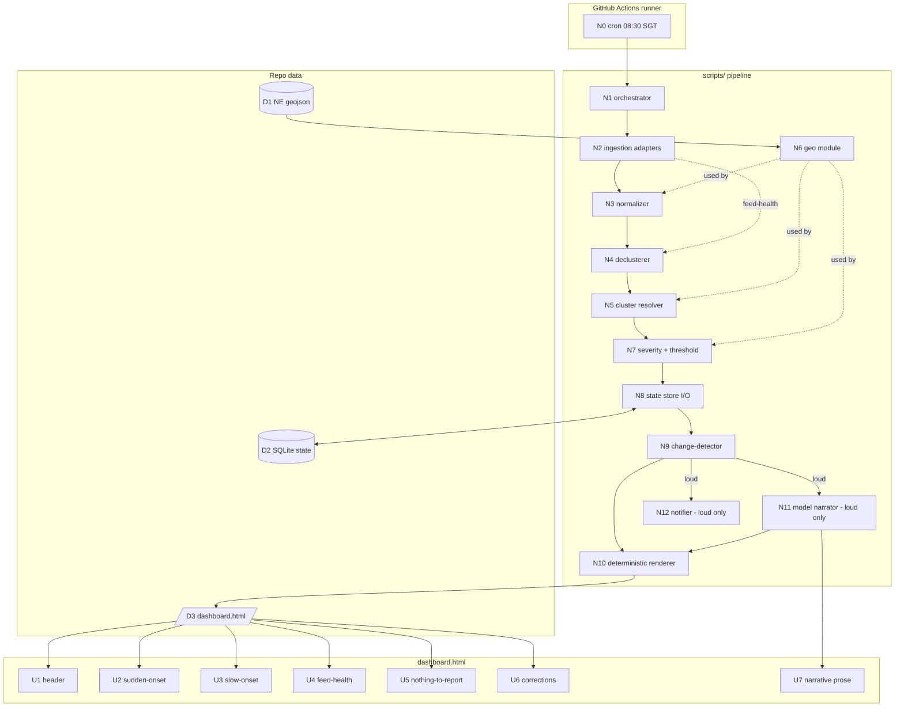

# HADR Monitor — Breadboard (Shape A)

Concrete affordances and wiring for the selected shape (`SHAPING.md` → Shape A).
Tables are the source of truth; the Mermaid diagram renders them. This is the
whole-product breadboard; `SLICES.md` cuts it into demo-able increments.

Because the only human surface is a **static** `dashboard.html`, UI affordances
have no click-wiring — their "wire" is the data field each renders *from*. All
behaviour lives in the non-UI pipeline.

## Places

- **`dashboard.html`** — the read-only morning page (the only UI surface).
- **GitHub Actions runner** — the scheduled entrypoint (08:30 SGT).
- **`scripts/` pipeline** — the deterministic decision core + the guarded model step.
- **Repo data** — vendored geo data, the SQLite state file, the HTML output.

## UI Affordances (Place: `dashboard.html`)

| ID | Affordance | Renders from |
|----|------------|--------------|
| **U1** | Header: title · window label ("last 24h ending 08:30 SGT") · SGT publish timestamp · coverage banner ("earthquakes only (USGS)…") | N10 ← report meta |
| **U2** | Sudden-onset section (ranked list of event lines) | N10 ← thresholded clusters |
| **U2.1** | Event line: severity chip · what/where (hazard + ISO3 place) · impact figure + source · magnitude descriptor · as-of/age · change-flag (`NEW`/`REVISED ↑`/`CORRECTED`) | N10 ← one cluster record |
| **U3** | Slow-onset / ongoing section (window-exempt crises) | N10 ← ongoing clusters |
| **U4** | Feed-health section: per feed — name · as-of · status (green/red) · outage/degradation note | N10 ← feed-health records |
| **U5** | Nothing-to-report line (only when U2 is empty) | N10 ← empty threshold result |
| **U6** | Correction/retraction line (inline in U2) | N10 ← change-detector deletions/downgrades |
| **U7** | Narrative prose block (loud mornings only) | N11 (model), injected via N10 |

## Non-UI Affordances

| ID | Affordance | Place | Wires out |
|----|------------|-------|-----------|
| **N0** | Cron trigger 08:30 SGT (`sitrep.yml`) | GH Actions | → N1 |
| **N1** | Orchestrator entrypoint | scripts/ | → N2, then N3–N10 |
| **N2** | Ingestion adapters (USGS / GDACS / ReliefWeb) — polite per-feed headers, **log the final URL fetched**, `feed_fetch_succeeded` flag | scripts/ | → N3; → N4 (feed-health) |
| **N3** | Normalizer → common model (nullable `event_time`, ISO3 **list**, UTC attached, provenance per field) | scripts/ | → N4 |
| **N4** | Declusterer (space/time/mag → one sequence) | scripts/ | → N5 |
| **N5** | Cluster resolver — confidence ladder, **EQ identity link first** (`SPIKE-cross-feed-confidence`) | scripts/ | → N7; uses N6 |
| **N6** | Geo module — `iso3_for` / `is_onshore` via ray-casting over D1 (`SPIKE-onshore-geocode`) | scripts/ | used by N3, N5, N7 |
| **N7** | Severity + threshold engine — PAGER/GDACS lookup + slice-1 mag/depth/onshore/`sig≥600`; named constants | scripts/ | → N8 |
| **N8** | State store (SQLite / `sqlite3`) read+write — ADR-0007 minimum | scripts/ | ↔ D2; → N9 |
| **N9** | Change-detector — six loud triggers, `feed_fetch_succeeded` guard | scripts/ | → N10; gates N11, N12 |
| **N10** | Deterministic renderer → writes `dashboard.html` (**always runs**, stamps publish + per-feed as-of) | scripts/ | → D3 → U1–U6 |
| **N11** | Model narrator — `claude -p` running `/sitrep`, prose only, **loud only** | scripts/ | → U7 via N10 |
| **N12** | Notifier — loud only (+ optional daily all-clear ping, R5.1) | scripts/ | → external |

| ID | Data affordance | Place |
|----|-----------------|-------|
| **D1** | Vendored `data/ne_110m_admin_0_countries.geojson` | repo data |
| **D2** | SQLite state file | repo data |
| **D3** | `dashboard.html` output | repo data |

## Wiring

